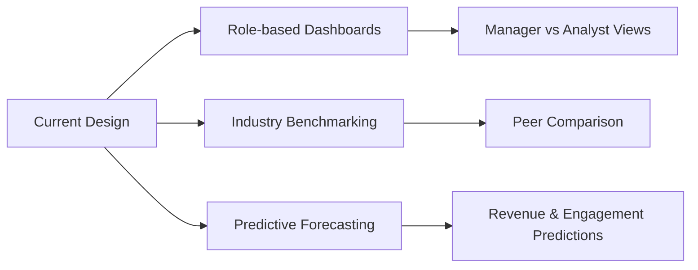

<div align="center">

# 📊 Xeno PM Intern Assignment
### *From Login to Impact*

[](https://figma.com)
[](https://canva.com)

**👤 Candidate:** Merlyn Victor  
**📋 Role:** Product Management Internship Assignment

---

</div>

## 🧩 Problem Statement

> Design the first screen after login for a retail marketer using Xeno, such that the screen:
> - Helps marketers quickly understand what's happening across campaigns, customers, and revenue
> - Enables them to take the most meaningful and impactful actions with minimal effort

**The Challenge:** Create not just a dashboard, but a **decision and action hub** aligned with Xeno's mission of AI-powered personalization and profitable growth.

---

## 🏢 About Xeno

Xeno is a **NextGen loyalty and customer engagement platform** that enables retail brands to:

```
✓ Build a 360° unified customer view
✓ Run AI-driven, personalized, omnichannel campaigns
✓ Automate engagement across the entire customer lifecycle
✓ Drive measurable incremental revenue using loyalty, offers, and gamification
```

---

## 🎯 Target User: Retail Marketing Manager

<table>
<tr>
<td width="50%">

### 🔴 Key Challenges
- Overloaded with campaigns across multiple channels
- Difficult to personalize at scale
- Hard to identify what's working and what needs attention
- Needs to prove ROI and act quickly

</td>
<td width="50%">

### 🟢 What They Need on Login
- Clear performance snapshot
- Visibility into opportunities & issues
- Actionable recommendations, not just data

</td>
</tr>
</table>

---

## 🧠 Product Thinking & Design Principles

<div align="center">

| 💰 **Revenue-First** | ⚡ **Action-Oriented** | 👥 **Persona-Centric** |
|:---:|:---:|:---:|
| Focus on metrics that directly impact revenue & retention | Every insight paired with clear next step or CTA | Organized around customer behavior, not channels |

</div>

---

## 🧱 Homepage Structure

### 1️⃣ **Performance Snapshot** (Top KPIs)
```yaml
- Incremental revenue generated
- Personalization score
- Active journeys
- Offer redemption rate
```

### 2️⃣ **AI-Powered Recommendations** ⭐ *Core Section*
- Next best actions based on customer personas
- One-click campaign/journey creation

### 3️⃣ **Campaign & Journey Overview**
- Unified cross-channel performance view
- Status, engagement, and revenue attribution

### 4️⃣ **Loyalty & Recent Activity**
- Engagement trends
- Real-time customer interactions

### 5️⃣ **Quick Action Shortcuts**
- Create campaign
- Create journey
- Create offer or segment

> 💡 **Design Pattern:** F-pattern scan ensuring the most important information is seen first

---

## ✂️ Intentional Trade-offs

<table>
<tr>
<th>✅ Included</th>
<th>❌ Excluded</th>
</tr>
<tr>
<td>

- Revenue-linked KPIs
- AI recommendations
- Action-driven components

</td>
<td>

- Deep analytics
- Admin & configuration settings
- Low-frequency tasks

</td>
</tr>
</table>

**Rationale:** The homepage is optimized for **speed, clarity, and action**, while deeper analysis lives on dedicated pages.

---

## 📈 Success Metrics

<div align="center">

| Metric | Target | Why It Matters |
|--------|--------|----------------|
| ⏱️ Time-to-first-action | < 45 seconds | Measures usability & clarity |
| 🤖 AI recommendation adoption | Track % | Validates AI value proposition |
| 🚀 Campaigns launched via recommendations | Increase | Shows action enablement |
| 📊 Personalization score improvement | Upward trend | Proves platform impact |

</div>

> These metrics measure **real behavioral impact**, not just usage.

---

## 🔮 Future Iterations



**Philosophy:** *Show value fast → enable action faster*

---

## 🛠️ Tools & Technologies

<div align="center">


**Frameworks Used:** Personas | JTBD | Prioritization | Success Metrics  
**Research:** Xeno website, product videos, use-case analysis

</div>

---

## ✅ Outcome

<div align="center">

### This solution delivers:

🎯 **Instant understanding** of performance  
🤖 **Clear, AI-driven** next actions  
🚀 **Strong alignment** with Xeno's product vision

> The homepage acts as a **command center**, not just a dashboard — translating Xeno's promise of personalization into immediate, measurable impact.

</div>

---

## 🔗 Submission Links

<div align="center">

### 📄 [**View Final Presentation Deck**](https://www.canva.com/design/DAG6rKq9A0A/CJc0SISFTUsYy5DBoX6y1A/edit?utm_content=DAG6rKq9A0A&utm_campaign=designshare&utm_medium=link2&utm_source=sharebutton)

[](https://www.canva.com/design/DAG6rKq9A0A/CJc0SISFTUsYy5DBoX6y1A/edit?utm_content=DAG6rKq9A0A&utm_campaign=designshare&utm_medium=link2&utm_source=sharebutton)

</div>

---

## 🙏 Closing Note

<div align="center">

**Thank you for reviewing my submission!**

I thoroughly enjoyed working on this problem and would love the opportunity to  
discuss my approach, decisions, and learnings further.

---

*Made with ❤️ by Merlyn Victor*

[]()
[]()

</div>
